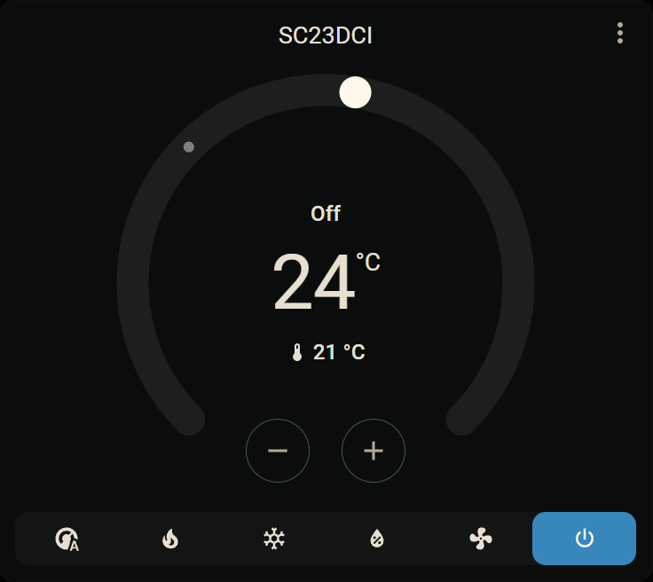
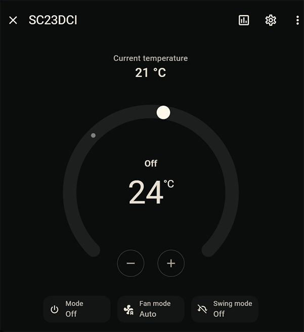

# SC23DCI

## About this Project
Lorem Ipsum

## Docker image
[Image on hub.docker.com][3]

## Compatible devices
Lorem Ipsum

### First indicator: the display
Lorem Ipsum

### The WiFi chip: ESP-01S
Lorem Ipsum
Open the front panel
<table>
  <th>HVAC without fron panel</th><th>ESP chip</th>
  <tr>
    <td>
      
    </td>
    <td>
      
    </td>
  </tr>
</table>

Investigate the PCB of the Display to see if there is a ESP-01S

SC23DCI HVAC MQTT agent
Works with Devices like this one: [FRICO SOLOCLIM DE][1]

## Setup AC

### 1. Activate Wi-Fi

While the A/C is running, long press the power icon on the display. After a few seconds you can cycle through `[on, rst, off]` by tapping the power icon. This sets Wi-Fi on/off or resets the WiFi-Config. When the display shows the desired value, wait a few seconds and the setting is saved.

Entering this menu can be a bit tedious because the A/C tends to just turn off when the power icon is pressed. You can try this: Turn the A/C off, then double tap the power icon and do not lift your finger on the second tap. I think it takes ~5 seconds until the menu appears.

If you were successful, the A/C will create a WLAN, through which it can be configured using the [app][2] and can be integrated into your WLAN.

### 2. Setup Wi-Fi

Setup your Wi-Fi in your A/C unit using [this app][2].

## Setting up MQTT-Agent

### 1. **Configure `.env` File**

**Required:**
- `MQTT_BROKER_IP`: The IP or URL of the MQTT broker.
- `SC23DCI_IP`: The IP or URL of the AC device.

<strong>Optional:</strong>

- `MQTT_BROKER_PORT`: The port of the MQTT broker.
  - Default: `1883`
- `MQTT_TOPIC_TEMPERATURE`: The topic to publish the temperature.
  - Default: `sc23dci/sensors/temperature/ac`
- `MQTT_TOPIC_ALL`: The topic to publish all values as a single JSON.
  - Default: `sc23dci/all`
- `MQTT_TOPIC_POWERSTATE`: The topic to publish the power state.
  - Default: `sc23dci/powerstate`
- `MQTT_TOPIC_POWERSTATE_SET`: The topic to subscribe for power state commands.
  - Default: `sc23dci/powerstate/set`
- `MQTT_TOPIC_MODE_SET`: The topic to subscribe for mode commands.
  - Default: `sc23dci/mode/set`
- `MQTT_TOPIC_SETPOINT_SET`: The topic to subscribe for setpoint commands.
  - Default: `sc23dci/setpoint/set`
- `MQTT_TOPIC_FLAP_MODE`: The topic to publish the flap rotation mode.
  - Default: `sc23dci/flap_mode`
- `MQTT_TOPIC_FLAP_MODE_SET`: The topic to subscribe for flap rotation commands.
  - Default: `sc23dci/flap_mode/set`
- `MQTT_TOPIC_FAN_SPEED`: The topic to publish the fan speed.
  - Default: `sc23dci/fan_speed`
- `MQTT_TOPIC_FAN_SPEED_SET`: The topic to subscribe for fan speed commands.
  - Default: `sc23dci/fan_speed/set`
- `MQTT_TOPIC_NIGHT_MODE_SET`: The topic to subscribe for night mode commands.
  - Default: `sc23dci/night_mode/set`
- `MQTT_TOPIC_LWT`: The topic to publish the Last Will and Testament (LWT) message.
  - Default: `sc23dci/lwt`
- `MQTT_HASSIO_AUTODETECT`: Enable or disable Zeroconf Home Assistant autodetect.
  - Default: `True`
- `MQTT_HASSIO_OBJECT_ID`: Set the unique ID of the AC for Home Assistant.
  - Default: `SC23DCI-unique-id-not-set`
- `MQTT_HASSIO_TOPIC`: The topic set in the MQTT integration in Home Assistant.
  - Default: `homeassistant`
- `SC23DCI_MAX_TEMP_C`: Maximum temperature that can be set on the AC.
  - Default: `31`
- `SC23DCI_MIN_TEMP_C`: Minimum temperature that can be set on the AC.
  - Default: `16`
- `SC23DCI_POLL_INTERVAL`: Interval in seconds to poll data from the AC.
    - Default: `10`
- `LOG_LEVEL`: Minimum logging level/verbosity: 
    - `TRACE, DEBUG, INFO, SUCCESS, WARNING, ERROR, CRITICAL`
    - Default: `INFO` 

### 2. Run `docker-compose up` or `docker-compose up -d`.

### 3. Control the device via MQTT

<strong>Home Assistant</strong>

| Home Assistant climate | Home Assistant climate detail |
| --------------------------------------------------------- | ------------------------------------------------------------------------ |
|  |  |

By default, the autodiscovery for Home Assistant is enabled. If you do not want to use this then you need to set the environment Variable in `.env.file`:

`MQTT_HASSIO_AUTODETECT=False`

If you want to use the autodiscovery for Home Assistant and you want to use more than one AC then make sure to set a unique ID:

`MQTT_HASSIO_OBJECT_ID=SC23DCI-unique-id`

<strong>Set temperature</strong>

- eg. set temperature to 20°C

If the configured topic is `sc23dci/sensors/temperature/ac`, publish the payload `20` to `sc23dci/sensors/temperature/ac`.

<strong>Set mode</strong>

- eg. set mode to cooling

If the configured topic is `sc23dci/mode/set`, publish the payload `1` or `cooling` to `sc23dci/mode/set`.

Modes:
- `0: heating`
- `1: cooling`
- `3: dehumidification`
- `4: fanonly`
- `5: auto`
- `6: off`

<strong>Power device on/off</strong>

- eg. turn device off (standby, Wi-Fi will still be up)

If the configured topic is `sc23dci/powerstate/set`, publish the payload `0` or `off` to `sc23dci/powerstate/set`.

States:
- `0: off`
- `1: on`

<strong>Set fan speed</strong>

- eg. set fan to auto

If the configured topic is `sc23dci/fan_speed/set`, publish the payload `0` or `auto` to `sc23dci/fan_speed/set`.

Speeds:
- `0: auto`
- `1: low`
- `2: medium`
- `3: high`

<strong>Set flap rotation</strong>

- eg. enable flap rotation

If the configured topic is `sc23dci/flap_mode/set`, publish the payload `0` or `on` to `sc23dci/flap_mode/set`.

Flap states:
- `0: on`
- `7: off`

<strong>Set night mode</strong>

- eg. enable night mode

If the configured topic is `sc23dci/night_mode/set`, publish the payload `1` or `on` to `sc23dci/night_mode/set`.

Flap states:
- `0: off`
- `1: on`

[1]: https://www.frico.net/fileadmin/user_upload/frico/Pdf/cat_frico_soloclim_de.pdf
[2]: https://play.google.com/store/apps/details?id=it.kumbe.innovapp20
[3]: https://hub.docker.com/r/cheerio123/sc23dci